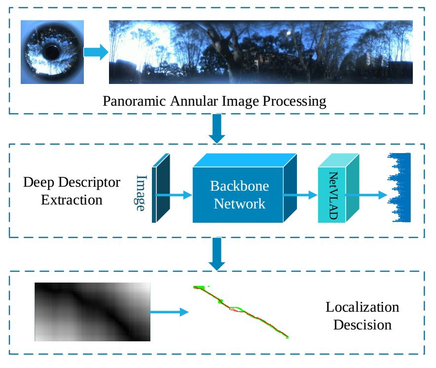

# PAL: Panoramic Annular Localizer
This repository implements the panoramic visual localization algorithm. 



If you use this code or dataset, please cite the following [paper](https://arxiv.org/abs/1905.05425).
```
R. Cheng et al., "Panoramic Annular Localizer: Tackling the Variation Challenges of Outdoor Localization Using Panoramic Annular Images and Active Deep Descriptors," 2019 IEEE Intelligent Transportation Systems Conference (ITSC), Auckland, New Zealand, 2019, pp. 920-925. doi: 10.1109/ITSC.2019.8917508
```

## Dataset
Yuquan dataset (with panoramic images) used in the paper can be downloaded [here](https://drive.google.com/open?id=1Xh9V6-99JweI-jek7r8-OUIzftNA30Uo).


## Code
The descriptor extraction (NetVLAD of panorama) is [here](https://github.com/chengricky/PanoramicScenePlaceRecognition).

The sequence matching of PAL is [here](https://github.com/chengricky/MMPR).

The evaluation script is `evaluation.py`.